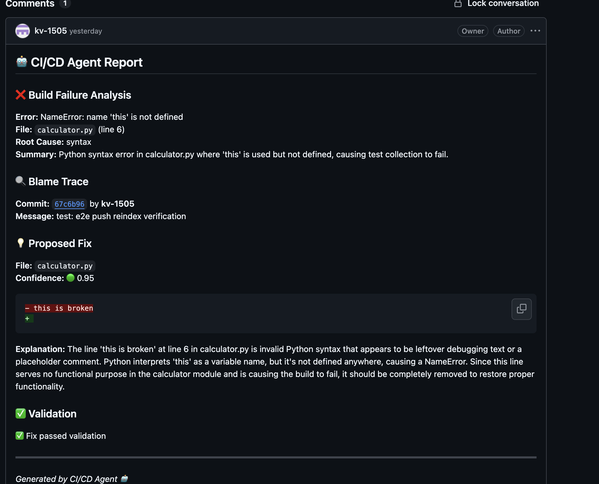
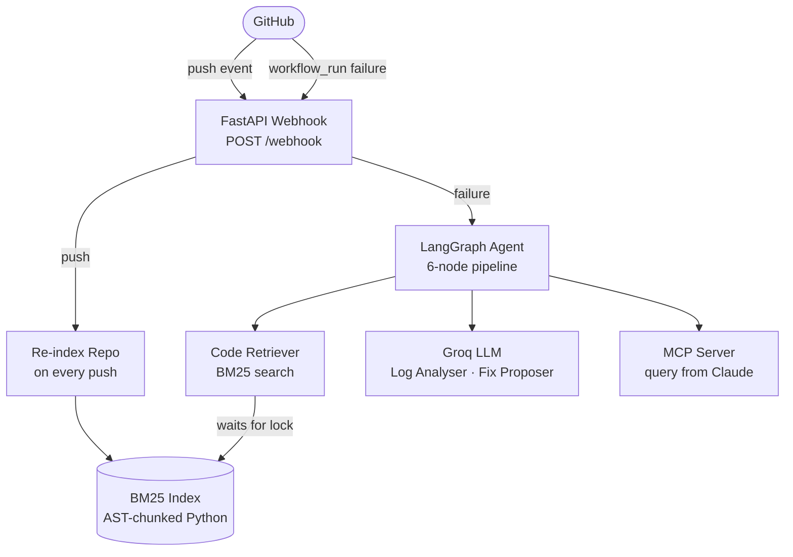

# CI/CD Agent 🤖


An autonomous agent that watches your GitHub Actions pipelines, diagnoses failures, traces the responsible commit, proposes a targeted fix, and posts a structured report — all without human intervention.

---

## Why I Built This

As a developer working across Angular, Java, and DevOps at SAP, I constantly ran into the same frustration: a CI build fails, and you have to manually dig through hundreds of log lines, figure out which file broke, find the commit that introduced it, and then context-switch back into the code to fix it. It kills flow. I built this agent to do all of that automatically — the moment a build fails, it analyses the logs, traces the blame, proposes a fix, and posts it directly on GitHub.

---

## Demo

> Agent detects a syntax error, traces the blame commit, proposes a fix with 95% confidence, and posts the report to GitHub.



**Live example:** [View a real agent report on GitHub →](https://github.com/kv-1505/cicd-agent/commit/67c6b969b4e196a4be763ccfd5b124bd6d86336e)

**Live server:** [https://cicd-agent.onrender.com/health](https://cicd-agent.onrender.com/health)

---

## How It Works

When a GitHub Actions workflow fails, the agent runs a 6-step pipeline:

```
GitHub Actions fails
        │
        ▼
┌───────────────┐
│  Log Analyser │  Parses CI logs → extracts error, file, line number
└──────┬────────┘
       │
       ▼
┌───────────────┐
│ Blame Tracer  │  Finds the commit + author responsible via GitHub API
└──────┬────────┘
       │
       ▼
┌────────────────┐
│ Code Retriever │  BM25 search — fetches relevant code context from index
└──────┬─────────┘
       │
       ▼
┌───────────────┐
│ Fix Proposer  │  LLM proposes a targeted fix (snippet-level, not full file)
└──────┬────────┘
       │
       ▼
┌───────────────┐     fails (max 2 retries)
│   Validator   │ ──────────────────────────► Fix Proposer
└──────┬────────┘
       │ passes
       ▼
┌───────────────┐
│  PR Reporter  │  Posts structured Markdown report to GitHub PR or commit
└───────────────┘
```

---

## Architecture



**Key design decisions:**
- **Push-based re-indexing** — index is rebuilt on every push, so the agent always queries fresh code
- **Thread-safe locking** — if re-indexing and a failure arrive simultaneously, the agent waits for indexing to finish before querying
- **Snippet-level diffs** — fix proposals show only the changed line, not the whole file
- **Retry loop** — validator rejects low-confidence or syntactically invalid fixes and loops back to Fix Proposer (max 2 retries)
- **BM25 over vector embeddings** — lightweight keyword search works well for code (exact variable/function names), no GPU or heavy model needed
- **MCP server** — exposes `diagnose_failure` as a tool, so you can query any repo's failures directly from Claude

---

## MCP Server

The agent exposes two tools via the [Model Context Protocol](https://modelcontextprotocol.io):

| Tool | Description |
|------|-------------|
| `get_recent_failures` | List recent failed workflow runs for any repo |
| `diagnose_failure` | Run the full agent pipeline on a specific run ID |

**Usage in Claude Code:**
```
> Get recent failures for owner/repo
> Diagnose failure #26236504769 in kv-1505/cicd-agent-test
```

**Setup:**
```bash
claude mcp add cicd-agent \
  -e GROQ_API_KEY=... \
  -e GITHUB_TOKEN=... \
  -- /path/to/venv/bin/python /path/to/mcp_server/server.py
```

---

## Tech Stack

| Layer | Technology |
|-------|-----------|
| Webhook server | FastAPI + Uvicorn |
| Agent orchestration | LangGraph |
| LLM | Groq (llama-3.3-70b-versatile) |
| Code search | BM25 (rank-bm25) |
| Code chunking | Python AST parser |
| GitHub API | PyGithub |
| MCP server | Model Context Protocol SDK |
| Deployment | Docker + Render |
| Signature verification | HMAC-SHA256 |

---

## Project Structure

```
cicd-agent/
├── main.py                  # FastAPI server, webhook handler, reindex lock
├── config.py                # Environment variable loader
├── Dockerfile               # Container for Render deployment
├── agent/
│   ├── graph.py             # LangGraph pipeline definition + retry logic
│   ├── state.py             # AgentState TypedDict
│   └── nodes/
│       ├── log_analyser.py  # Parse CI logs → structured error JSON
│       ├── blame_tracer.py  # Find responsible commit via GitHub API
│       ├── code_retriever.py# BM25 search with reindex-lock awareness
│       ├── fix_proposer.py  # LLM proposes targeted fix
│       ├── validator.py     # Syntax check + confidence + placeholder check
│       └── pr_reporter.py   # Post Markdown report to GitHub
├── rag/
│   ├── indexer.py           # Clone repo, AST-chunk Python files, build BM25 index
│   └── retriever.py         # BM25 search, return formatted code context
├── mcp_server/
│   └── server.py            # MCP tools: diagnose_failure, get_recent_failures
└── gh_client/
    ├── client.py            # Fetch + decode workflow logs (ZIP format)
    └── webhook.py           # Verify GitHub webhook HMAC signature
```

---

## Getting Started

### 1. Clone and install

```bash
git clone https://github.com/kv-1505/cicd-agent.git
cd cicd-agent
python -m venv venv && source venv/bin/activate
pip install -r requirements.txt
```

### 2. Configure environment

```bash
cp .env.example .env
```

Edit `.env`:

```env
GROQ_API_KEY=gsk_...
GITHUB_TOKEN=ghp_...
GITHUB_WEBHOOK_SECRET=your_secret_here
REPO_FULL_NAME=owner/repo
```

### 3. Start the server

```bash
uvicorn main:app --port 8000
```

### 4. Expose locally with ngrok (for testing)

```bash
ngrok http 8000
```

### 5. Add GitHub webhook

In your repo → **Settings → Webhooks → Add webhook**:
- **Payload URL:** `https://<your-ngrok-url>/webhook`
- **Content type:** `application/json`
- **Secret:** same as `GITHUB_WEBHOOK_SECRET`
- **Events:** `push` + `workflow_run`

Now push a broken commit and watch the agent post a report.

---

## Deployment

The agent is deployed on Render using Docker. To deploy your own instance:

1. Fork this repo
2. Connect to [Render](https://render.com) → New Web Service → select your fork
3. Add env vars: `GROQ_API_KEY`, `GITHUB_TOKEN`, `GITHUB_WEBHOOK_SECRET`, `REPO_FULL_NAME`
4. Deploy — Render auto-detects the Dockerfile
